# KCS WMS ERD (Entity Relationship Diagram)

**최종 갱신:** 2026-03-22
**DB:** MariaDB 10.11 (localhost:3306)
**총 테이블:** 59개

---

## 1. Mermaid ERD

```mermaid
erDiagram
    %% ═══════════ 시스템관리 (TMSYS) ═══════════
    users {
        varchar id PK
        varchar email UK
        varchar password
        varchar name
        enum role
        boolean isActive
        varchar company
        varchar duty
        varchar department
        varchar phone
        varchar mobile
        boolean multiLogin
    }
    roles {
        varchar id PK
        varchar code UK
        varchar name
        json permissions
        boolean isActive
    }
    programs {
        varchar id PK
        varchar code UK
        varchar name
        varchar programUrl
        varchar parentId FK
        int menuLevel
        int sortOrder
        boolean isActive
    }
    role_programs {
        varchar id PK
        varchar roleId FK
        varchar programId FK
        boolean canRead
        boolean canWrite
        boolean canDelete
        boolean canExport
    }
    multilinguals {
        varchar id PK
        varchar langCode
        varchar msgKey
        text msgValue
        varchar module
    }
    interface_logs {
        varchar id PK
        varchar interfaceType
        varchar direction
        varchar status
        text requestData
        text responseData
    }
    helpdesks {
        varchar id PK
        varchar ticketNo UK
        varchar title
        varchar screenName
        text content
        varchar category
        varchar priority
        varchar status
        varchar requesterId
        varchar assigneeId
    }

    %% ═══════════ 기준관리 (WMSMS) ═══════════
    warehouses {
        varchar id PK
        varchar code UK
        varchar name
        varchar country
        varchar city
        varchar address
        enum status
        enum temperatureType
        boolean isBonded
    }
    zones {
        varchar id PK
        varchar warehouseId FK
        varchar code
        varchar name
        enum type
    }
    locations {
        varchar id PK
        varchar zoneId FK
        varchar code
        enum status
        varchar aisle
        varchar rack
        varchar level
        varchar bin
    }
    docks {
        varchar id PK
        varchar warehouseId FK
        varchar code
        varchar name
        float maxTonnage
    }
    vehicles {
        varchar id PK
        varchar plateNo UK
        float tonnage
        varchar driverName
        varchar warehouseId FK
        boolean isActive
    }
    common_codes {
        varchar id PK
        varchar codeType
        varchar typeNm
        varchar code
        varchar codeNm
        varchar value
    }
    item_groups {
        varchar id PK
        varchar code UK
        varchar name
        varchar groupType
        float weightToleranceRate
        int minShelfLife
    }
    uom_masters {
        varchar id PK
        varchar code UK
        varchar name
    }
    uom_conversions {
        varchar id PK
        varchar itemId FK
        varchar fromUomId FK
        varchar toUomId FK
        float convQty
    }
    work_policies {
        varchar id PK
        varchar warehouseId FK
        varchar policyType
        varchar policyName
        boolean fifoEnabled
        boolean fefoEnabled
    }

    %% ═══════════ 상품/거래처 ═══════════
    items {
        varchar id PK
        varchar code UK
        varchar name
        varchar barcode UK
        enum category
        enum uom
        float unitPrice
        varchar itemGroupId FK
        boolean lotControl
        boolean expiryControl
    }
    partners {
        varchar id PK
        varchar code UK
        varchar name
        enum type
        varchar businessNo
        varchar creditRating
        boolean shipControl
        boolean isActive
    }
    set_items {
        varchar id PK
        varchar parentItemId FK
        varchar childItemId FK
        int quantity
    }
    partner_products {
        varchar id PK
        varchar partnerId FK
        varchar customerPartnerId FK
        varchar itemId FK
        boolean expiryControl
    }
    location_products {
        varchar id PK
        varchar locationCode
        varchar itemId FK
        varchar partnerId FK
    }

    %% ═══════════ 입고관리 (WMSOP) ═══════════
    inbound_orders {
        varchar id PK
        varchar orderNumber UK
        varchar partnerId FK
        varchar warehouseId FK
        enum orderType
        enum status
        datetime expectedDate
        varchar blNo
    }
    inbound_order_items {
        varchar id PK
        varchar inboundOrderId FK
        varchar itemId FK
        int expectedQty
        int receivedQty
        int damagedQty
        varchar lotNo
    }
    inbound_receipts {
        varchar id PK
        varchar inboundOrderId FK
        varchar receivedBy
        varchar lotNo
        varchar locationCode
    }

    %% ═══════════ 출고관리 ═══════════
    outbound_orders {
        varchar id PK
        varchar orderNumber UK
        varchar partnerId FK
        varchar warehouseId FK
        enum orderType
        enum status
        int orderSeq
        varchar deliveryTo
        varchar blNo
        boolean isUrgent
    }
    outbound_order_items {
        varchar id PK
        varchar outboundOrderId FK
        varchar itemId FK
        int orderedQty
        int pickedQty
        int packedQty
        int shippedQty
        int defectiveQty
    }
    outbound_shipments {
        varchar id PK
        varchar outboundOrderId FK
        varchar carrier
        varchar trackingNumber
    }

    %% ═══════════ 재고관리 (WMSST) ═══════════
    inventories {
        varchar id PK
        varchar itemId FK
        varchar warehouseId FK
        varchar locationId FK
        varchar lotNo
        int quantity
        int reservedQty
        int availableQty
        datetime expiryDate
    }
    inventory_transactions {
        varchar id PK
        varchar itemId FK
        varchar warehouseId
        enum txType
        int quantity
        varchar referenceType
        varchar referenceId
    }
    stock_adjustments {
        varchar id PK
        varchar warehouseId
        varchar itemCode
        int adjustQty
        enum reason
        varchar performedBy
    }
    cycle_counts {
        varchar id PK
        varchar warehouseId
        varchar locationCode
        int systemQty
        int countedQty
        int variance
        enum status
    }
    inventory_movements {
        varchar id PK
        varchar warehouseId
        enum status
        varchar performedBy
    }
    inventory_movement_items {
        varchar id PK
        varchar movementId FK
        varchar itemCode
        varchar fromLocation
        varchar toLocation
        int moveQty
    }
    stock_transfers {
        varchar id PK
        varchar warehouseId FK
        varchar itemId FK
        varchar fromLocationCode
        varchar toLocationCode
        int quantity
        varchar status
    }
    ownership_transfers {
        varchar id PK
        varchar workNumber
        varchar status
        varchar fromPartnerId
        varchar toPartnerId
    }
    assemblies {
        varchar id PK
        varchar workNumber
        varchar status
        varchar warehouseId FK
    }
    assembly_items {
        varchar id PK
        varchar assemblyId FK
        varchar itemId
        int quantity
        varchar type
    }

    %% ═══════════ 배차/작업지시 ═══════════
    dispatches {
        varchar id PK
        varchar warehouseId FK
        varchar vehicleId FK
        varchar inboundOrderId FK
        varchar outboundOrderId FK
        datetime dispatchDate
        int dispatchSeq
        enum status
    }
    dispatch_items {
        varchar id PK
        varchar dispatchId FK
        varchar itemCode
        int orderedQty
        int dispatchedQty
    }
    work_orders {
        varchar id PK
        varchar orderNumber
        varchar warehouseId FK
        enum workType
        enum status
        varchar assignedTo
    }
    work_order_items {
        varchar id PK
        varchar workOrderId FK
        varchar itemCode
        varchar fromLocation
        varchar toLocation
        int plannedQty
        int actualQty
    }
    order_histories {
        varchar id PK
        varchar orderType
        varchar orderId
        varchar action
        text beforeData
        text afterData
    }

    %% ═══════════ 정산 (WMSAC) ═══════════
    settlements {
        varchar id PK
        varchar warehouseId FK
        varchar partnerId FK
        enum status
        varchar contractDept
        varchar contractEmployee
        float inboundFee
        float outboundFee
        float storageFee
        float transportFee
        float shuttleFee
        float totalAmount
    }
    settlement_details {
        varchar id PK
        varchar settlementId FK
        datetime workDate
        varchar itemCode
        int inboundQty
        int outboundQty
    }
    settlement_rates {
        varchar id PK
        varchar warehouseId
        varchar rateType
        float unitPrice
        varchar currency
    }
    period_closes {
        varchar id PK
        varchar periodType
        datetime periodDate
        varchar warehouseId FK
        varchar status
    }

    %% ═══════════ 물류용기 (WMSPL) ═══════════
    container_groups {
        varchar id PK
        varchar groupCode UK
        varchar groupName
    }
    containers {
        varchar id PK
        varchar containerCode UK
        varchar containerName
        varchar containerGroupId FK
        varchar partnerId FK
        float weight
        float unitPrice
    }
    container_inventories {
        varchar id PK
        varchar containerCode
        int normalStock
        int optimalStock
        varchar locationCode
    }

    %% ═══════════ 채널연동 ═══════════
    sales_channels {
        varchar id PK
        varchar name
        enum platform
        varchar sellerId
        varchar warehouseId FK
        enum status
        json credentials
        boolean syncEnabled
    }
    channel_orders {
        varchar id PK
        varchar channelId FK
        varchar platformOrderId
        enum status
        datetime orderDate
        varchar outboundOrderId FK
    }
    channel_order_items {
        varchar id PK
        varchar channelOrderId FK
        varchar itemId FK
        int quantity
        float unitPrice
    }
    channel_products {
        varchar id PK
        varchar channelId FK
        varchar itemId FK
        varchar platformSku
    }
    channel_sync_logs {
        varchar id PK
        varchar channelId FK
        enum syncType
        enum direction
        varchar status
        int recordCount
    }

    %% ═══════════ 템플릿 (WMSTP) ═══════════
    templates {
        varchar id PK
        varchar code UK
        varchar name
        varchar templateType
        int startRow
    }
    template_columns {
        varchar id PK
        varchar templateId FK
        int colSeq
        varchar colName
        boolean isMandatory
    }
    owner_templates {
        varchar id PK
        varchar templateId FK
        varchar partnerId
    }
    owner_template_columns {
        varchar id PK
        varchar ownerTemplateId FK
        int colSeq
        varchar colName
        boolean isUsed
    }

    %% ═══════════════════════════════════════
    %% RELATIONSHIPS
    %% ═══════════════════════════════════════

    %% 권한 관계
    roles ||--o{ role_programs : has
    programs ||--o{ role_programs : has
    programs ||--o{ programs : "parent-child"

    %% 창고 계층
    warehouses ||--o{ zones : contains
    zones ||--o{ locations : contains
    warehouses ||--o{ docks : has
    warehouses ||--o{ vehicles : assigned

    %% 상품
    item_groups ||--o{ items : groups
    items ||--o{ set_items : "parent"
    uom_masters ||--o{ uom_conversions : "from"
    uom_masters ||--o{ uom_conversions : "to"

    %% 입고
    partners ||--o{ inbound_orders : supplies
    warehouses ||--o{ inbound_orders : receives
    inbound_orders ||--o{ inbound_order_items : contains
    inbound_orders ||--o{ inbound_receipts : has
    items ||--o{ inbound_order_items : referenced

    %% 출고
    partners ||--o{ outbound_orders : ships_to
    warehouses ||--o{ outbound_orders : ships_from
    outbound_orders ||--o{ outbound_order_items : contains
    outbound_orders ||--o{ outbound_shipments : has
    outbound_orders ||--o{ dispatches : dispatched
    items ||--o{ outbound_order_items : referenced

    %% 재고
    items ||--o{ inventories : stocked
    warehouses ||--o{ inventories : stored_in
    locations ||--o{ inventories : located
    items ||--o{ inventory_transactions : tracked
    inventory_movements ||--o{ inventory_movement_items : contains
    assemblies ||--o{ assembly_items : contains

    %% 배차/작업
    warehouses ||--o{ dispatches : dispatched
    vehicles ||--o{ dispatches : assigned
    inbound_orders ||--o{ dispatches : linked
    dispatches ||--o{ dispatch_items : contains
    warehouses ||--o{ work_orders : has
    work_orders ||--o{ work_order_items : contains

    %% 정산
    warehouses ||--o{ settlements : billed
    settlements ||--o{ settlement_details : has

    %% 물류용기
    container_groups ||--o{ containers : groups
    partners ||--o{ containers : owned

    %% 채널
    warehouses ||--o{ sales_channels : linked
    sales_channels ||--o{ channel_orders : receives
    sales_channels ||--o{ channel_products : maps
    sales_channels ||--o{ channel_sync_logs : logs
    channel_orders ||--o{ channel_order_items : contains
    items ||--o{ channel_order_items : referenced
    items ||--o{ channel_products : linked
    outbound_orders ||--o{ channel_orders : fulfills

    %% 템플릿
    templates ||--o{ template_columns : has
    templates ||--o{ owner_templates : customized
    owner_templates ||--o{ owner_template_columns : has

    %% 마감
    warehouses ||--o{ period_closes : closed
```

---

## 2. 테이블 목록 (59개)

### 시스템관리 (7)
| # | 테이블명 | Prisma 모델 | 화면설계서 ID | 설명 |
|---|---------|------------|-------------|------|
| 1 | users | User | TMSYS030 | 사용자관리 |
| 2 | roles | Role | TMSYS050 | 권한관리 |
| 3 | programs | Program | TMSYS040 | 프로그램관리 |
| 4 | role_programs | RoleProgram | TMSYS060-080 | 권한-프로그램매핑 |
| 5 | multilinguals | Multilingual | WMSYS020 | 다국어관리 |
| 6 | interface_logs | InterfaceLog | TMSYS090 | 인터페이스현황 |
| 7 | helpdesks | Helpdesk | TMSYS130 | HelpDesk |

### 기준관리 (11)
| # | 테이블명 | Prisma 모델 | 화면설계서 ID | 설명 |
|---|---------|------------|-------------|------|
| 8 | warehouses | Warehouse | WMSMS030 | 물류센터정보 |
| 9 | zones | Zone | WMSMS081 | ZONE정보 |
| 10 | locations | Location | WMSMS080 | 로케이션정보 |
| 11 | docks | Dock | WMSMS120 | 도크장정보 |
| 12 | vehicles | Vehicle | WMSMS050 | 차량관리 |
| 13 | common_codes | CommonCode | TMSYS010 | 기준관리(공통코드) |
| 14 | item_groups | ItemGroup | WMSMS094 | 상품군관리 |
| 15 | uom_masters | UomMaster | WMSMS100 | UOM정보 |
| 16 | uom_conversions | UomConversion | WMSMS101 | UOM환산 |
| 17 | work_policies | WorkPolicy | WMSMS020 | 센터별작업정책 |
| 18 | location_products | LocationProduct | WMSMS101 | LOC별입고상품 |

### 상품/거래처 (4)
| # | 테이블명 | Prisma 모델 | 화면설계서 ID | 설명 |
|---|---------|------------|-------------|------|
| 19 | items | Item | WMSMS090 | 상품정보 |
| 20 | partners | Partner | WMSMS010 | 화주/거래처 |
| 21 | set_items | SetItem | WMSMS092 | 세트상품 |
| 22 | partner_products | PartnerProduct | WMSMS095 | 화주별거래처상품 |

### 입고관리 (3)
| # | 테이블명 | Prisma 모델 | 화면설계서 ID | 설명 |
|---|---------|------------|-------------|------|
| 23 | inbound_orders | InboundOrder | WMSOP010/020 | 입고오더 |
| 24 | inbound_order_items | InboundOrderItem | WMSOP041 | 입고오더상세 |
| 25 | inbound_receipts | InboundReceipt | WMSOP020 | 입고확정 |

### 출고관리 (3)
| # | 테이블명 | Prisma 모델 | 화면설계서 ID | 설명 |
|---|---------|------------|-------------|------|
| 26 | outbound_orders | OutboundOrder | WMSOP030 | 출고오더 |
| 27 | outbound_order_items | OutboundOrderItem | WMSOP030 | 출고오더상세 |
| 28 | outbound_shipments | OutboundShipment | WMSOP030 | 출고배송 |

### 재고관리 (11)
| # | 테이블명 | Prisma 모델 | 화면설계서 ID | 설명 |
|---|---------|------------|-------------|------|
| 29 | inventories | Inventory | WMSST010 | 현재고 |
| 30 | inventory_transactions | InventoryTransaction | WMSST020 | 재고입출고내역 |
| 31 | stock_adjustments | StockAdjustment | WMSST050 | 재고조정 |
| 32 | cycle_counts | CycleCount | WMSST060 | 재고실사 |
| 33 | inventory_movements | InventoryMovement | WMSST030 | 재고이동 |
| 34 | inventory_movement_items | InventoryMovementItem | WMSST030 | 재고이동상세 |
| 35 | stock_transfers | StockTransfer | WMSST040 | 재고이동현황 |
| 36 | ownership_transfers | OwnershipTransfer | WMSST100 | 명의변경 |
| 37 | assemblies | Assembly | WMSST070 | 임가공 |
| 38 | assembly_items | AssemblyItem | WMSST070 | 임가공상세 |
| 39 | container_inventories | ContainerInventory | WMSST011 | 용기재고 |

### 배차/작업지시 (5)
| # | 테이블명 | Prisma 모델 | 화면설계서 ID | 설명 |
|---|---------|------------|-------------|------|
| 40 | dispatches | Dispatch | WMSOP050 | 배차작업 |
| 41 | dispatch_items | DispatchItem | WMSOP051 | 배차상세 |
| 42 | work_orders | WorkOrder | WMSST020 | 작업지시 |
| 43 | work_order_items | WorkOrderItem | WMSST020 | 작업지시상세 |
| 44 | order_histories | OrderHistory | WMSOP013 | 주문이력 |

### 정산관리 (4)
| # | 테이블명 | Prisma 모델 | 화면설계서 ID | 설명 |
|---|---------|------------|-------------|------|
| 45 | settlements | Settlement | WMSAC020 | 정산산출 |
| 46 | settlement_details | SettlementDetail | WMSAC021 | 정산상세 |
| 47 | settlement_rates | SettlementRate | WMSAC010 | 정산단가 |
| 48 | period_closes | PeriodClose | WMSMS130 | 마감관리 |

### 물류용기 (3)
| # | 테이블명 | Prisma 모델 | 화면설계서 ID | 설명 |
|---|---------|------------|-------------|------|
| 49 | container_groups | ContainerGroup | WMSPL020 | 물류용기군 |
| 50 | containers | Container | WMSPL010 | 물류용기 |
| 51 | container_inventories | ContainerInventory | WMSST011 | 용기재고 |

### 채널연동 (5)
| # | 테이블명 | Prisma 모델 | 설명 |
|---|---------|------------|------|
| 52 | sales_channels | SalesChannel | 판매채널 |
| 53 | channel_orders | ChannelOrder | 채널주문 |
| 54 | channel_order_items | ChannelOrderItem | 채널주문상세 |
| 55 | channel_products | ChannelProduct | 채널상품매핑 |
| 56 | channel_sync_logs | ChannelSyncLog | 동기화로그 |

### 템플릿 (4)
| # | 테이블명 | Prisma 모델 | 화면설계서 ID | 설명 |
|---|---------|------------|-------------|------|
| 57 | templates | Template | WMSTP010 | 템플릿양식 |
| 58 | template_columns | TemplateColumn | WMSTP020 | 템플릿컬럼 |
| 59 | owner_templates | OwnerTemplate | WMSTP030 | 화주템플릿 |
| 60 | owner_template_columns | OwnerTemplateColumn | WMSTP040 | 화주템플릿컬럼 |

---

## 3. 데이터 현황

| 테이블 | 건수 | 테이블 | 건수 |
|--------|------|--------|------|
| users | 6 | items | 20 |
| warehouses | 4 | partners | 8 |
| zones | 17 | locations | 52 |
| docks | 5 | vehicles | 4 |
| common_codes | 18 | item_groups | 4 |
| uom_masters | 6 | uom_conversions | 3 |
| inbound_orders | 7 | inbound_order_items | 19 |
| inbound_receipts | 3 | outbound_orders | 10 |
| outbound_order_items | 19 | outbound_shipments | 2 |
| inventories | 18 | inventory_transactions | 27 |
| stock_adjustments | 3 | cycle_counts | 4 |
| inventory_movements | 1 | inventory_movement_items | 1 |
| period_closes | 2 | settlements | 0 |
| settlement_details | 0 | settlement_rates | 0 |
| dispatches | 0 | dispatch_items | 0 |
| work_orders | 0 | work_order_items | 0 |
| assemblies | 0 | assembly_items | 0 |
| containers | 0 | container_groups | 0 |
| container_inventories | 0 | stock_transfers | 0 |
| ownership_transfers | 0 | set_items | 0 |
| partner_products | 0 | location_products | 0 |
| order_histories | 0 | interface_logs | 0 |
| sales_channels | 0 | channel_orders | 0 |
| channel_order_items | 0 | channel_products | 0 |
| channel_sync_logs | 0 | roles | 0 |
| programs | 0 | role_programs | 0 |
| multilinguals | 0 | templates | 0 |
| template_columns | 0 | owner_templates | 0 |
| owner_template_columns | 0 | work_policies | 0 |
| helpdesks | 0 | - | - |

**데이터 보유 테이블:** 21개 (총 249건)
**빈 테이블:** 38개

---

## 4. 이번 변경 사항

### 추가된 컬럼
| 테이블 | 컬럼 | 타입 | 설명 |
|--------|------|------|------|
| users | department | VARCHAR(50) | 부서 |
| users | multiLogin | BOOLEAN | 중복로그인허용 |
| settlements | contractDept | VARCHAR(100) | 계약부서 |
| settlements | contractEmployee | VARCHAR(50) | 계약담당자 |
| settlements | transportFee | FLOAT | 운송비 |
| settlements | shuttleFee | FLOAT | 셔틀비 |
| helpdesks | screenName | VARCHAR(100) | 화면명 |
| work_orders | orderNumber | VARCHAR(30) | 작업지시번호 |

### 추가된 관계
| From | To | 관계 |
|------|-----|------|
| Dispatch | OutboundOrder | N:1 (outboundOrderId) |
| OutboundOrder | Dispatch[] | 1:N (dispatches) |
